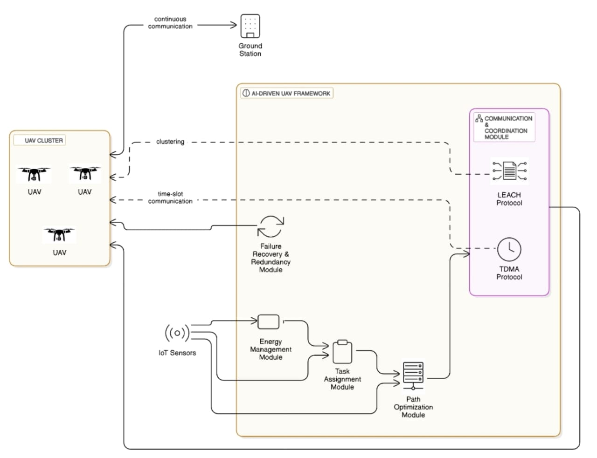

# Multi-UAV Task Offloading and Simulation Project

The surge in the use of multi-UAV systems in monitoring, disaster management, and wireless network communications increases the need for efficient balancing of the operational load and resource-aware task separation to maximize performance and system lifetime. Impaired task allocation may cause overuse of power, congestion of the network, and low overall efficiency. This paper suggests an intelligent balancing of load framework which combines energy-directed task placement, heuristic trajectory planning of UAVs, and resource-aware management. Using high-level algorithms and real-time optimization approaches allows for improvement in UAV coordination, energy preservation, and equity in task distribution. The approach seeks to achieve improved reliability of networks, increased flight time of UAVs, and enhanced system survivability under dynamic resource-poor conditions.

---

## Features

### Python-Based Simulation (Tkinter GUI)
- Deploy and visualize multiple UAVs and IoT nodes
- Dynamic UAV movement via threading
- Smart task offloading using proximity and energy criteria
- Real-time simulation of data transfer paths
- Energy consumption comparison (single vs multi-UAV access)
- Matplotlib-based energy graph plotting

### Web-Based Visualization (HTML + JS)
- Animated UAV movement using Canvas
- User-selectable number of requests
- UAV signal dispatch and collision avoidance
- 2D simulation of UAV communication with IoT devices
- Realistic 3D-ish axis representation

---

## File Structure

```
UAV-Offloading-Project/
├── UAVOffloading.py         # Python GUI simulation
├── simulation.js            # Web animation logic
├── index.html               # Web interface and visualization
└── README.md                # Project documentation
```

---

## Requirements

### Python Environment:
- Python 3.x
- tkinter
- matplotlib
- numpy

To install dependencies:
```bash
pip install matplotlib numpy
```

---

## How to Run

### Run Python Simulation:
```bash
python UAVOffloading.py
```
Steps:
1. Input number of IoT nodes
2. Select a node ID for offloading
3. Click "Generate IoT Network" to deploy UAVs and nodes
4. Click "IoT Task Offloading" to begin simulation
5. Use "Energy Graph" to visualize energy consumption comparison

### Run Web Visualization:
1. Open `index.html` in any modern browser
2. Choose number of UAVs (requests)
3. Click "Send Signal" to trigger simulation

---

## Architecture Diagram


---


### D. Performance Graphs
- Energy Comparison Graph  
  [Energy Graph]("Screenshots/Energy_Consumption.jpg")

- Latency Reduction Graph  
  [Latency Graph]("Screenshots/Latency.jpg")

- Task Completion Efficiency Graph  
  [Efficiency Graph]("Screenshots/Task_Completion.jpg")

---

## Conclusion
The proposed multi-UAV framework significantly outperforms the traditional single UAV approach. It ensures:
- Better task allocation
- Energy-efficient operations
- Lower latency in task delivery
- High scalability in dynamic environments

It is ideal for use cases such as disaster recovery, smart surveillance, and autonomous logistics.

---

## License
This project is licensed under the MIT License.

---

## Author and Co-Author
**Pranjal Gautam, Bhargavi Joshi, Paras Yadav**
Feel free to reach out for contributions, improvements, or queries related to simulations and optimizations in UAV systems.
